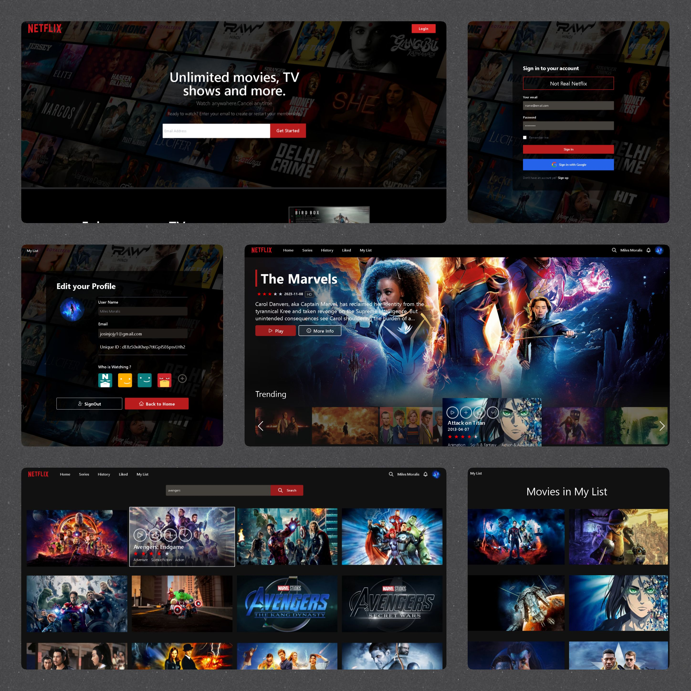

Here's a polished `README.md` for your **Netflix Clone React.js** project on GitHub, updated with structured formatting, professional language, and embedded image instructions (you can use the one you uploaded as a sample preview):

---

````markdown
# 🎬 Netflix Clone – React.js



A fully functional **Netflix clone** built using **React.js**, replicating the core features of the original streaming platform. This project showcases modern web development practices, including user authentication, dynamic content rendering, responsive UI, and API integration with **TMDB**. Designed as a learning and portfolio project, it offers users an immersive movie-browsing experience.

---

## 🚀 Overview

This project was created to improve hands-on experience in front-end development using modern tools and frameworks. It replicates several features of Netflix, with backend support from **Firebase** and data fetched through the **TMDB API**.

---

## ✨ Key Features

- 🔐 **Sign In / Sign Up** – Secure authentication with Firebase.
- 🏠 **Home Page** – Browse featured and trending movies.
- ❤️ **Liked Movies Page** – View and manage liked movies.
- 🎬 **Play Movie Page** – Watch trailers using YouTube integration.
- 🔎 **Search Page** – Search for movies with real-time suggestions.
- ✅ **Watched Movies** – Keep track of what you've watched.
- 🎯 **My List** – Personal movie collection.
- 👤 **Profile Page** – Edit user profile and sign out.

---

## 🧰 Technologies Used

- ⚛️ React.js
- 🔥 Firebase (Authentication + Firestore)
- 🎥 TMDB API
- 📦 Axios
- 🎞️ Swiper.js
- 📺 React-Youtube
- 🎨 Tailwind CSS

---


## 🔧 How to Run Locally

1. **Clone the repo**
```bash
git clone https://github.com/yourusername/netflix-clone-react.git
cd netflix-clone-react
````

2. **Install dependencies**

```bash
npm install
```

3. **Configure Firebase and TMDB**

   * Create a Firebase project and enable Authentication (Email/Password).
   * Create a `.env` file and add your API keys:

     ```
     REACT_APP_FIREBASE_API_KEY=your_key
     REACT_APP_TMDB_API_KEY=your_key
     ```

4. **Run the app**

```bash
npm start
```

---

## 📚 Learning Goals

* Strengthen React.js skills (components, hooks, state management)
* Integrate third-party APIs effectively (TMDB, YouTube)
* Implement Firebase for full-stack features (auth, database)
* Practice responsive design using Tailwind CSS

---

## 📌 Notes

> This project is for educational and portfolio purposes only. It does not stream real content or serve commercial use.

---
